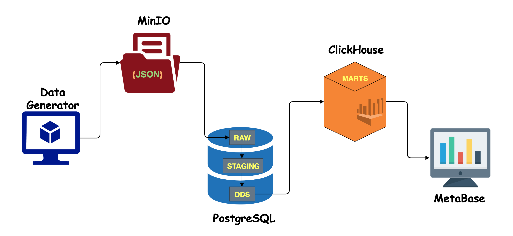
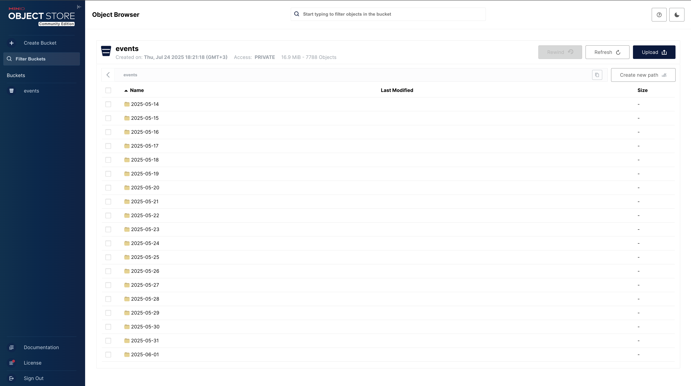
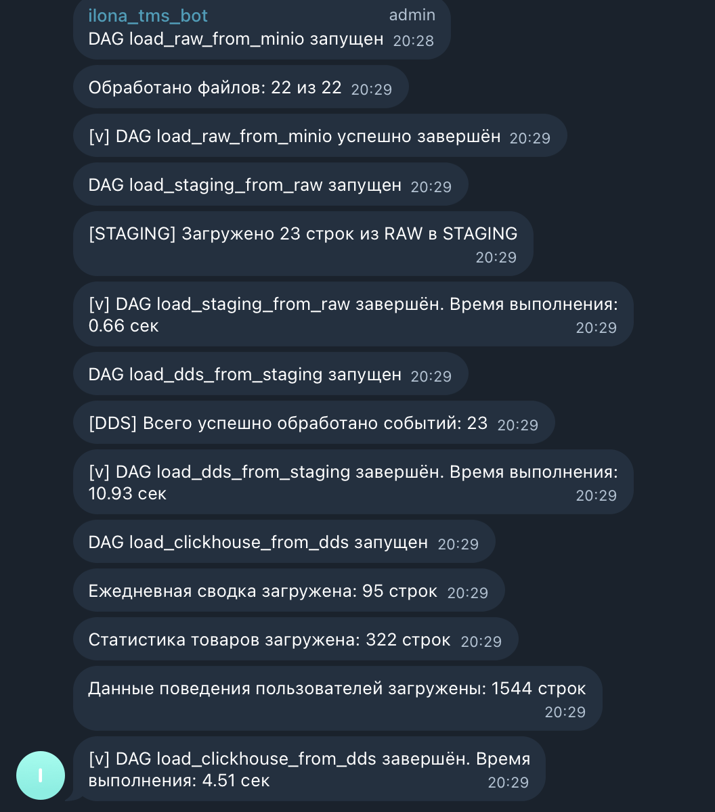
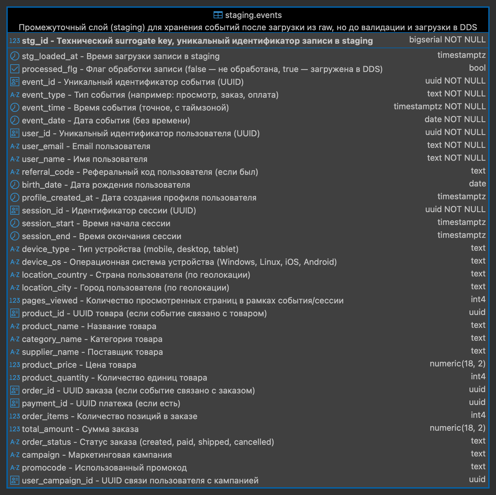
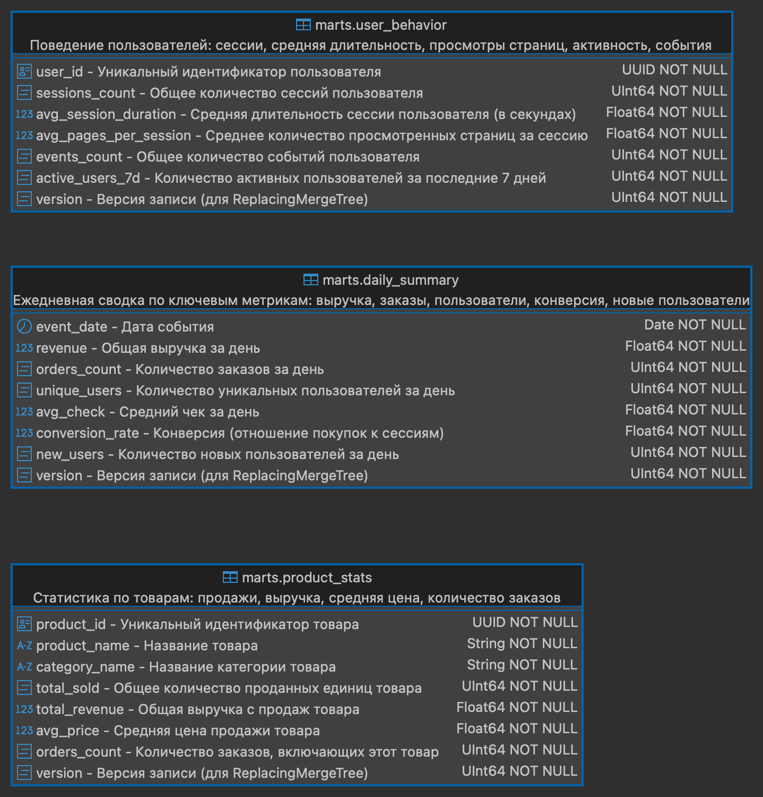
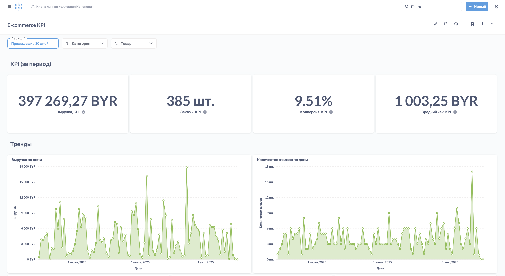
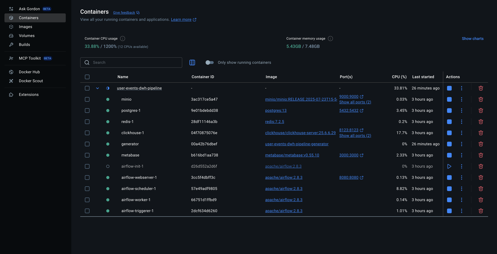
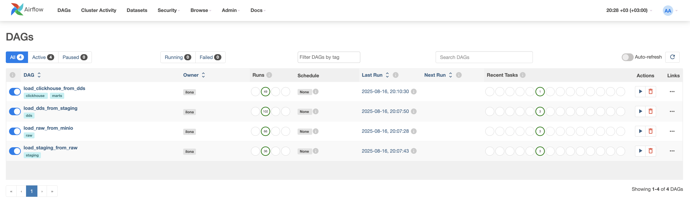
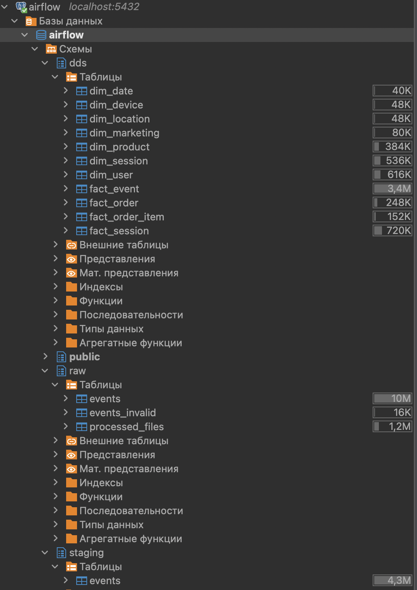
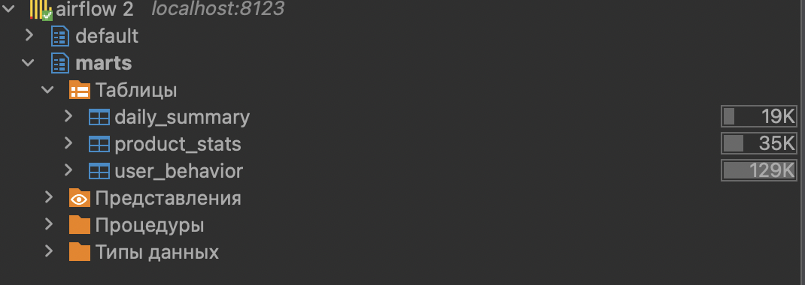

# 📊 user-events-dwh-pipeline

**Автор:** Кононович Илона Сергеевна  
**Год:** 2025

---
<a id="annotation"></a>
## Аннотация 📝
Полноценный ETL-пайплайн, моделирующий работу промышленного корпоративного хранилища данных (DWH).  

- **Данные:** события пользователей веб-приложения (просмотры страниц, добавления в корзину, заказы, маркетинговые активности).  
- **Этапы обработки:** валидация, очистка и многослойная загрузка в хранилище.  
- **Результат:** агрегированные аналитические витрины, готовые для подключения к BI-инструментам и построения дашбордов.  

Таким образом, проект демонстрирует полный путь данных — от «сырых» событий до готовых бизнес-метрик.  


<p align="center">
  
</p>

---

## 📚 Оглавление

- [Аннотация 📝](#annotation)
- [Введение 🚀](#introduction)
- [Технологии 🛠](#technologies)
- [Архитектура 🏗](#architecture)
- [Логика пайплайна 🔄](#pipeline-logic)
- [Структура репозитория 📂](#repository-structure)
- [Результаты и выводы ✅](#results)
- [Приложения 📂](#appendices)
- [Запуск проекта ▶️](#project-run)

---

<a id="introduction"></a>
## Введение 🚀

Современные веб-приложения генерируют огромный поток событий: клики, просмотры страниц, заказы, платежи, маркетинговые активности. Эти данные ценны, но сами по себе они «сырые» и беспорядочные. Чтобы бизнес мог принимать решения на их основе, данные нужно:  
- надёжно собирать,  
- проверять на корректность,  
- хранить в структурированном виде,  
- предоставлять в виде удобных аналитических витрин.  

**Основные задачи:**  
- Организовать полный цикл обработки данных с валидацией (проверкой качества) и аудитом (протоколированием шагов).  
- Нормализовать данные в хранилище и построить аналитические витрины для BI-систем.  
- Настроить автоматическую работу пайплайнов и мониторинг: от алертов об ошибках до логирования прогресса загрузок. 

**Что делает проект:**  
- Реализует ETL-пайплайн с разделением на слои: `raw`, `staging`, `dds`, `marts`. 
- Проверяет и очищает данные, чтобы в аналитике не было ошибок и дубликатов.  
- Автоматически обновляет витрины, чтобы аналитики и продуктовые команды всегда работали с актуальной информацией.  
- Использует инструменты, которые применяются в реальных DWH-проектах.  
 

---


<a id="technologies"></a>
## Технологии 🛠

<div style="white-space: nowrap; margin-bottom: 16px;">

<!-- Docker -->
<table align="left" style="display:inline-table; margin-right:6px; background-color:#2496ed; border-radius:8px; padding:4px;">
  <tr>
    <td align="center" style="width:100px; height:100px;">
      <a href="https://www.docker.com/" target="_blank" style="text-decoration:none; color:white; font-family:sans-serif;">
        <br>
        <b>Docker</b><br>
        <span style="font-size:10px;">24.0.6</span>
      </a>
    </td>
  </tr>
</table>

<!-- Python -->
<table align="left" style="display:inline-table; margin-right:6px; background-color:#3776ab; border-radius:8px; padding:4px;">
  <tr>
    <td align="center" style="width:100px; height:100px;">
      <a href="https://www.python.org/" target="_blank" style="text-decoration:none; color:white; font-family:sans-serif;">
        <br>
        <b>Python</b><br>
        <span style="font-size:10px;">3.12</span>
      </a>
    </td>
  </tr>
</table>

<!-- MinIO -->
<table align="left" style="display:inline-table; margin-right:6px; background-color:#f3a847; border-radius:8px; padding:4px;">
  <tr>
    <td align="center" style="width:100px; height:100px;">
      <a href="https://min.io/" target="_blank" style="text-decoration:none; color:white; font-family:sans-serif;">
        <br>
        <b>MinIO</b><br>
        <span style="font-size:10px;">2025-07-23</span>
      </a>
    </td>
  </tr>
</table>

<!-- Airflow -->
<table align="left" style="display:inline-table; margin-right:6px; background-color:#017cff; border-radius:8px; padding:4px;">
  <tr>
    <td align="center" style="width:100px; height:100px;">
      <a href="https://airflow.apache.org/" target="_blank" style="text-decoration:none; color:white; font-family:sans-serif;">
        <br>
        <b>Airflow</b><br>
        <span style="font-size:10px;">2.8.3</span>
      </a>
    </td>
  </tr>
</table>

<!-- PostgreSQL -->
<table align="left" style="display:inline-table; margin-right:6px; background-color:#336791; border-radius:8px; padding:4px;">
  <tr>
    <td align="center" style="width:100px; height:100px;">
      <a href="https://www.postgresql.org/" target="_blank" style="text-decoration:none; color:white; font-family:sans-serif;">
        <br>
        <b>PostgreSQL</b><br>
        <span style="font-size:10px;">13</span>
      </a>
    </td>
  </tr>
</table>

<!-- ClickHouse -->
<table align="left" style="display:inline-table; margin-right:6px; background-color:#f06423; border-radius:8px; padding:4px;">
  <tr>
    <td align="center" style="width:100px; height:100px;">
      <a href="https://clickhouse.com/" target="_blank" style="text-decoration:none; color:white; font-family:sans-serif;">
        <br>
        <b>ClickHouse</b><br>
        <span style="font-size:10px;">25.6.6.29</span>
      </a>
    </td>
  </tr>
</table>

<!-- Metabase -->
<table align="left" style="display:inline-table; margin-right:6px; background-color:#1d7cf2; border-radius:8px; padding:4px;">
  <tr>
    <td align="center" style="width:100px; height:100px;">
      <a href="https://www.metabase.com/" target="_blank" style="text-decoration:none; color:white; font-family:sans-serif;">
        <br>
        <b>Metabase</b><br>
        <span style="font-size:10px;">0.55.10</span>
      </a>
    </td>
  </tr>
</table>

</div>

<br clear="both">

- **Контейнеризация:** [Docker](https://www.docker.com/) / Docker Compose  
- **Генерация данных:** [Python](https://www.python.org/) (faker, json)  
- **Хранилище исходных событий:** [MinIO](https://min.io/)  
- **Оркестрация:** [Apache Airflow](https://airflow.apache.org/)  
- **Хранилище данных:** [PostgreSQL](https://www.postgresql.org/) (схемы raw, staging, dds)  
- **Валидация данных:** Pydantic, ограничения в SQL-скриптах  
- **Аналитические витрины:** [ClickHouse](https://clickhouse.com/)  
- **Визуализация:** [Metabase](https://www.metabase.com/)  


---

<a id="architecture"></a>
## Архитектура 🏗

Проект построен по классической многоуровневой архитектуре DWH:  

<p align="">
  
</p>

---

<a id="pipeline-logic"></a>
## Логика пайплайна 🔄

1. **Генерация событий и загрузка в MinIO**  
   - Генерация с помощью контейнера в Docker.
   - Скрипты в папке `generator` создают реалистичные JSON-события веб-аналитики (page_view, add_to_cart, purchase) с данными пользователей, сессий, товаров и маркетинговых кампаний.  
   - Каждую минуту формируются новые события, сохраняемые в MinIO, организованные по датам.  
   - Поддерживаются повторные взаимодействия пользователей и сессий для имитации поведения реальных клиентов.  

> 📌 Пример JSON-события (сокращённый для наглядности).  
> Полный пример доступен в [`generator/example_event.json`](./generator/example_event.json).

```json
{
  "event_id": "49bc8fe6-ed40-4248-9c53-1fedfa0c082c",         // 🔑 Уникальный идентификатор события
  "event_type": "purchase",                                   // 🔑 Тип события (page_view, add_to_cart, purchase)
  "event_time": "2025-05-19T23:41:56.964433+00:00",
  "event_date": "2025-05-19",
  "user": {                                                   // 🔑 Данные пользователя
    "user_id": "a5e1d660-68cb-43e4-b128-26339c53f57d",
    "email": "leonti69@example.com",
    "profile": {
      "name": "Юдин Гаврила Витальевич"
    }
  },
  "session": {                                                // 🔑 Данные сессии
    "session_id": "861a1ebe-c16b-40f8-97e0-7fa0d183f6bd",
    "pages_viewed": 1,
    "device": {
      "type": "mobile",
      "os": "Windows",
      "location": { "country": "Беларусь", "city": "Полоцк" }
    }
  },
  "products": [                                               // 🔑 Продукты события (если add_to_cart или purchase)
    {
      "name": "Подгузники",
      "category": "Детские товары",
      "price": 68.97,
      "quantity": 1
    }
  ],
  "order": {                                                  // 🔑 Данные заказа (если purchase)
    "total_amount": 68.97,
    "status": "created"
  },
  "marketing": {                                              // 🔑 Данные маркетинговой кампании
    "campaign": null
  }
}
```

<p align="">
  
</p>

---
2. **Загрузка в RAW слой**  
   - DAG Airflow `load_raw_from_minio` получает новые JSON-файлы из MinIO.
   - Каждое событие проверяется через Pydantic: структура, типы данных и обязательные поля.
   - Корректные события сохраняются в `raw.events`.  
   - Ошибочные или повреждённые события сохраняются в `raw.events_invalid`.  
   - Файлы помечаются как обработанные `raw_processed_files`, чтобы их не загружать повторно. 
   - Логирование и уведомления в Telegram показывают процесс и результат загрузки.


<p align="">
  
</p>

<p align="">
  
</p>

---

3. **Staging — подготовка данных**  
   - Загрузка через DAG `load_staging_from_raw`.
   - Промежуточный слой, где данные из RAW приводятся к удобному табличному виду:  
   - Из JSON-массивов (например, список товаров в заказе) делаются отдельные строки;  
   - Каждое свойство (название товара, цена, категория, количество и т. д.) выделяется в свою колонку;  
   - Поля приводятся к нужным типам (дата, число, строка);  
   - При загрузке проверяется, что одно и то же событие не вставляется повторно.  

<p align="">
  
</p>

---

4. **DDS — загрузка и нормализация**  
   - Загрузка через DAG `load_dds_from_staging`.
   - Последовательная загрузка DIM-таблиц с учётом зависимостей (пользователи → сессии → устройства → локации → маркетинг).  
   - Генерация surrogate keys и вставка уникальных записей в DIM для дальнейшей связи с FACT. 
   - Загрузка FACT-таблиц с корректной привязкой к DIM через внешние ключи. 
   - алидация событий с использованием Pydantic для обеспечения качества данных.
   - Батчевая обработка данных с логированием и уведомлениями в Telegram.  
   - Обновление статуса обработанных событий в `staging.events` для предотвращения повторной загрузки. 

<p align="">
  
</p>

---

5. **Marts — аналитические витрины для BI**  
   - Загружаются из DDS (Postgres) в ClickHouse через DAG `load_clickhouse_from_dds`.  
   - **daily_summary:** ежедневная сводка по метрикам (выручка, заказы, средний чек, новые и уникальные пользователи, конверсия).  
   - **product_stats:** статистика по товарам и категориям (количество продаж, выручка, средняя цена, количество заказов).  
   - **user_behavior:** поведение пользователей (количество сессий, средняя длительность, просмотры страниц, количество событий, активность за 7 дней).  
   - Используется версия записи (`version`) для безопасной замены старых данных.  
   - Логирование и уведомления в Telegram помогают отслеживать процесс загрузки и ошибки.


<p align="">
  
</p>

---

6. **Dashboard в Metabase**  
   - Визуализации строятся на основе витрин Marts:  
     - Ежедневная выручка, средний чек, количество заказов, конверсия  
     - Статистика по товарам и категориям  
     - Поведение пользователей: сессии, глубина просмотра, активные пользователи  

> 📌 Пример Дашборда (сокращённый для наглядности).  
> Полный пример доступен в [`dashboard/dashboard_example.pdf`](./dashboard/dashboard_example.pdf).

<p align="">
  
</p>


---
<a id="repository-structure"></a>
## Структура репозитория 📂

```text
project/
│
├── generator/              # Скрипты и контейнер для генерации событий, отправки их в Minio
├── dags/                   # DAG-файлы Airflow
├── dashboard/              # Пример дашборда в pdf формате и sql-запросы для построения графиков
├── diagrams/               # Графические диаграммы пайплайна
├── sql/
│   ├── raw/                # DDL и DML для слоя raw
│   ├── staging/            # DDL и DML для слоя staging
│   ├── dds/                # DDL и DML для слоя dds
│   └── marts/              # DDL и DML для витрин
├── utils/                  
│   ├── loading/            # Модули для загрузки и маппинга данных в DWH
│   ├── sql_db/             # Утилиты для работы с PostgreSQL (инициализация схем/таблиц, выполнение запросов, пути sql-скриптов)
│   ├── validation/         # Схемы Pydantic и функции проверки целостности данных, поступающих в RAW и DDS слои   
│   ├── constants.py        # Модуль, который содержит константы и порядок загрузки таблиц
│   └── telegram_logger.py  # Модуль для отправки уведомлений в Telegram через Bot API
│ 
├── .gitignore              # файлы и папки, исключённые из контроля версий
├── docker-compose.yaml     # Конфигурация сервисов проекта и их взаимодействия в Docker
├── env_example.txt         # шаблон файла с переменными окружения для проекта
├── LICENSE                 # лицензия проекта
└── README.md               # Документация с описанием проекта, структуры и инструкциями по запуску
```
---

<a id="results"></a>
## Результаты и выводы ✅

Что получаем:
- Консистентные витрины в ClickHouse: продуктовая, коммерческая и поведенческая аналитика. 
- Более прозрачные и качественные данные благодаря валидации и аудиту.
- Меньше времени на отчёты и подготовку данных благодаря автоматизации через Airflow.

Потенциал для улучшений:
- Реальное время обработки: подключить Kafka/Kinesis для почти мгновенного обновления витрин.
- Автопроверка качества: тесты на данные (Great Expectations, dbt) для быстрого выявления ошибок.
- Контроль схем: OpenAPI/JSON Schema и CI, чтобы изменения данных не ломали пайплайн.
- Удобные дашборды: расширить BI-инструменты (Tableau/Power BI) и подстраивать их под разные роли пользователей.

---

<a id="appendices"></a>
## Приложения 📂
- SQL-скрипты: [`sql`](./sql)
- Генератор событий: [`generator`](./generator)
- DAG’и Airflow: [`dags`](./dags)
- Дашборд: [`dashboard`](./dashboard)
- Диаграммы: [`diagrams`](./diagrams)

---

<a id="project-run"></a>
## Запуск проекта ▶️

#### 1. Предусловия

- Docker с поддержкой Docker Compose установлен.
- Перед запуском убедитесь, что нужные порты свободны:
   - Airflow (webserver): 8080  
   - Metabase: 3000  
   - MinIO: 9000 (API), 9001 (консоль)  
   - ClickHouse: 8123 (HTTP), 9002 (Native)  
   - PostgreSQL: 5432  

#### 2. Инициализация окружения:

- Клонировать репозиторий
```bash
   git clone https://github.com/IlonaKononovich/user-events-dwh-pipeline.git
   cd user-events-dwh-pipeline
```
- Создать файл `.env` в корне проекта по шаблону [env_example.txt](./env_example.txt) и заполнить своими значениями


#### 3.  Поднять инфраструктуру
```bash
   docker-compose up -d
```
   Проверить состояние:
```bash
   docker compose ps
```


<p align="">
  
</p>

#### 4.  Доступ к сервисам

- Airflow (Web)
   - URL: http://localhost:8080
   - Учётные данные: `_AIRFLOW_WWW_USER_USERNAME` / `_AIRFLOW_WWW_USER_PASSWORD` (из `.env`)

- MinIO UI
   - URL: http://localhost:9001
   - Учётные данные: `MINIO_ROOT_USER` / `MINIO_ROOT_PASSWORD` (из `.env`)

- Metabase
   - URL: http://localhost:3000
   - Учётные данные: создаются при первом входе

- Примечания:
   - Генератор событий запускается автоматически (сервис `generator`) и пишет файлы в `MINIO_BUCKET`.
   - PostgreSQL и ClickHouse настраиваются через значения из `.env` и подключаются через СУБД.
   - Все веб-интерфейсы доступны по указанным URL, а авторизация выполняется через переменные окружения, где это предусмотрено.

#### 5. Airflow (Connections)

Admin → Connections создайте/проверьте три соединения (имена должны совпадать с используемыми в DAG’ах):

- MinIO (S3 совместимое)
   - Conn Id: MinIO
   - Conn Type: Amazon Web Servies
   - Login: ${MINIO_ROOT_USER}
   - Password: ${MINIO_ROOT_PASSWORD}
   - Extra:
      ```json
      {
      "aws_access_key_id": "${MINIO_ROOT_USER}",
      "aws_secret_access_key": "${MINIO_ROOT_PASSWORD}",
      "region_name": "us-east-1",
      "endpoint_url": "${MINIO_ENDPOINT}",
      "verify": false
      } 
      ```

- PostgreSQL (DWH/raw/dds)
   - Conn Id: Postgres
   - Conn Type: Postgres
   - Host: postgres
   - Database: ${POSTGRES_DB}
   - Login: ${POSTGRES_USER}
   - Password: ${POSTGRES_PASSWORD}
   - Port: 5432


- ClickHouse (витрины/аналитика)
   - Conn Id: ClickHouse
   - Conn Type: HTTP
   - Host: clickhouse
   - Schema: ${CLICKHOUSE_DB}
   - Login: ${CLICKHOUSE_USER}
   - Password: ${CLICKHOUSE_PASSWORD}
   - Port: 9000


#### 6. Проверка MinIO 

В консоли или [UI-интерфейсе](http://localhost:9001) проверьте, что в `MINIO_BUCKET` появляются JSON-файлы событий.

<p align="">
  
</p>


#### 7. Airflow (запуск DAG)

- Открыть [Airflow](http://localhost:8080)
- Включите все DAG'и, если они не включены.
- DAG load_raw_from_minio запускается каждую минуту.
- Остальные DAG’и стартуют каскадом по триггерам.

<p align="">
  
</p>

#### 8. Проверка СУБД

Проверьте данные:
   - PostgreSQL: проверить данные в схемах raw, staging, dds.
   - ClickHouse: проверить данные в витринах marts.

<p align="">
  
</p>

<p align="">
  
</p>

#### 9. Дашборд

В [Metabase](http://localhost:3000) необходимо самостоятельно построить дашборд на основе загруженных данных.

- В папке `dashboard` находится PDF-файл с примером дашборда [`dashboard_example.pdf`](./dashboard/dashboard_example.pdf), демонстрирующий, какие визуализации и метрики должны быть включены.
- Также в папке `dashboard` есть файл [`dashboard_queries.py`](./dashboard/dashboard_queries.py), содержащий SQL-запросы для построения графиков.
- Подключитесь к ClickHouse через Metabase.
- Используйте данные из ClickHouse для выполнения запросов и создания визуализаций.
- Сформируйте финальный дашборд согласно примерам и метрикам.

<p align="">
  
</p>