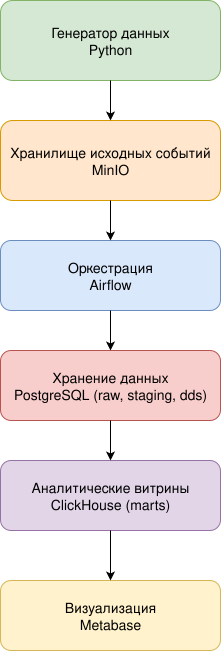
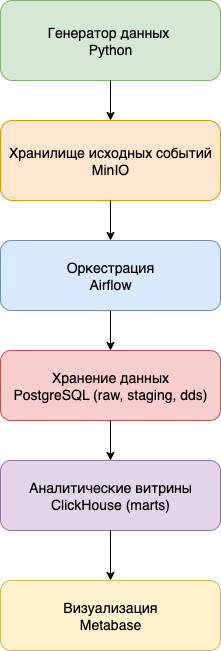

# 📊 user-events-dwh-pipeline

**Автор:** Кононович Илона Сергеевна  
**Год:** 2025

---
## 📝 Аннотация  
Полноценный ETL-пайплайн, моделирующий работу промышленного корпоративного хранилища данных (DWH).  

- **Данные:** события пользователей веб-приложения (просмотры страниц, добавления в корзину, заказы, маркетинговые активности).  
- **Этапы обработки:** валидация, очистка и многослойная загрузка в хранилище.  
- **Результат:** агрегированные аналитические витрины, готовые для подключения к BI-инструментам и построения дашбордов.  

Таким образом, проект демонстрирует полный путь данных — от «сырых» событий до готовых бизнес-метрик.  







---

## 📚 Оглавление

- [Аннотация](#аннотация)
- [Введение](#введение)
  - [Цели проекта (исходный раздел)](#цели-проекта-исходный-раздел)
- [Технологии](#технологии)
- [Архитектура](#архитектура)
  - [Описание слоёв](#описание-слоёв)
- [Данные и ETL-процесс](#данные-и-etl-процесс)
  - [Extract](#extract)
  - [Transform](#transform)
  - [Load](#load)
- [Логика пайплайна (исходный раздел)](#логика-пайплайна-исходный-раздел)
- [Результаты и выводы](#результаты-и-выводы)
- [Dashboard в Metabase (исходный раздел)](#dashboard-в-metabase-исходный-раздел)
- [Структура репозитория](#структура-репозитория)
- [Запуск проекта](#запуск-проекта)
  - [1. Предусловия](#1-предусловия)
  - [2. Инициализация окружения](#2-инициализация-окружения)
  - [3. Поднять инфраструктуру](#3--поднять-инфраструктуру)
  - [4. Доступ к сервисам](#4--доступ-к-сервисам)
  - [5. Airflow (Connections)](#5-airflow-connections)
  - [6. Проверка-minio](#6-проверка-minio)
  - [7. Airflow (запуск-dag)](#7-airflow-запуск-dag)
  - [8. Проверка-субд](#8-проверка-субд)
  - [9. Дашборд](#9-дашборд)
- [Заключение](#заключение)
- [Приложения](#приложения)

---
## 🚀 Введение

Современные веб-приложения генерируют огромный поток событий: клики, просмотры страниц, заказы, платежи, маркетинговые активности. Эти данные ценны, но сами по себе они «сырые» и беспорядочные. Чтобы бизнес мог принимать решения на их основе, данные нужно:  
- надёжно собирать,  
- проверять на корректность,  
- хранить в структурированном виде,  
- предоставлять в виде удобных аналитических витрин.  

**Что делает проект:**  
- Реализует ETL-пайплайн с разделением на слои: `raw`, `staging`, `dds`, `marts`. 
- Проверяет и очищает данные, чтобы в аналитике не было ошибок и дубликатов.  
- Автоматически обновляет витрины, чтобы аналитики и продуктовые команды всегда работали с актуальной информацией.  
- Использует инструменты, которые применяются в реальных DWH-проектах.  

**Основные задачи:**  
- Организовать полный цикл обработки данных с валидацией (проверкой качества) и аудитом (протоколированием шагов).  
- Нормализовать данные в хранилище и построить аналитические витрины для BI-систем.  
- Настроить автоматическую работу пайплайнов и мониторинг: от алертов об ошибках до логирования прогресса загрузок.  


---

## Технологии
> 📌 *[вставить логотипы ключевых технологий в один ряд]*

- **Контейнеризация:** Docker / Docker Compose  
- **Генерация данных:** Python (faker, json)  
- **Хранилище исходных событий:** MinIO  
- **Оркестрация:** Apache Airflow  
- **Хранилище сырья:** PostgreSQL (схемы raw, staging, dds)  
- **Валидация данных:** Pydantic, ограничения в SQL-скриптах  
- **Аналитические витрины:** ClickHouse  
- **Визуализация:** Metabase  

---

## 🏗 Архитектура

Проект построен по классической многоуровневой архитектуре DWH:  

`[Источник данных] → [RAW] → [STAGING] → [DDS] → [MARTS] → [Dashboard]`

> 📌 *[вставить диаграмму архитектуры/потока данных]*

### Описание слоёв

1. **Raw** — исходные события, валидные и некорректные, используются для аудита и повторной обработки.  
2. **Staging** — подготовка данных для ядра DWH, проверка на дубли, приведение типов и структур.  
3. **DDS (Data Delivery Store)** — нормализованная модель данных, DIM и FACT таблицы, связи через surrogate keys.  
4. **Marts** — агрегированные витрины для аналитики и BI, построенные на основе FACT и DIM таблиц.  

---

## Логика пайплайна

1. **Генерация событий (RAW слой)**  
   - Скрипты в папке `generator` создают реалистичные JSON-события веб-аналитики (page_view, add_to_cart, purchase) с данными пользователей, сессий, товаров и маркетинговых кампаний.  
   - Каждую минуту формируются новые события, сохраняемые в MinIO, организованные по датам.  
   - Поддерживаются повторные взаимодействия пользователей и сессий для имитации поведения реальных клиентов.  

> 📌 *[вставить пример JSON-события с подсветкой ключевых полей]*

2. **Загрузка в RAW слой**  
   - Airflow DAG читает новые JSON-события из MinIO.  
   - Валидирует каждое событие через Pydantic (структура, типы данных, обязательные поля).  
   - Корректные события сохраняются в `raw.events`.  
   - Некорректные или повреждённые события сохраняются в `raw.events_invalid`.  
   - Файлы помечаются как обработанные, чтобы исключить повторную загрузку.  
   - Логирование и уведомления в Telegram обеспечивают мониторинг успешности обработки.  

> 📌 *[вставить схему таблиц raw]*

3. **Staging — подготовка и очистка данных**  
   - Приведение формата дат и типов данных к единому стандарту.  
   - Разделение структурных сущностей для последующей загрузки в DDS (users, products, sessions, orders, маркетинг).  
   - Перенос событий из `raw.events` в `staging.events` батчами с проверкой на дубли и логированием.  
   - Поддержка аналитических и технических полей для упрощения последующей денормализации.  

   > 📌 *[вставить схему таблиц staging]*


4. **DDS — загрузка и нормализация**  
   - Последовательная загрузка DIM-таблиц с учётом зависимостей (например, пользователи → сессии → устройства).  
   - Вставка уникальных записей в DIM таблицы с получением surrogate keys для связи с FACT таблицами.  
   - Загрузка FACT-таблиц с внешними ключами на DIM записи.  
   - Валидирование событий через Pydantic перед записью в DDS.  
   - Батчевая обработка данных с логированием и уведомлениями в Telegram.  
   - Обновление статуса обработанных событий в `staging.events` для предотвращения повторной загрузки. 

> 📌 *[вставить ER-диаграмму DDS 

5. **Marts — аналитические витрины для BI**  
   - **daily_summary:** ежедневная сводка по метрикам (выручка, количество заказов, средний чек, новые и уникальные пользователи, конверсия).  
   - **product_stats:** статистика по товарам и категориям (продано единиц, выручка, средняя цена, количество заказов).  
   - **user_behavior:** поведение пользователей (количество сессий, средняя длительность, среднее число страниц за сессию, количество событий, активные пользователи за 7 дней). 

> 📌 *[вставить ER-диаграмму Marts 

6. **Dashboard в Metabase**  
   - Визуализации строятся на основе витрин Marts:  
     - Ежедневная выручка, средний чек, количество заказов, конверсия  
     - Статистика по товарам и категориям  
     - Поведение пользователей: сессии, глубина просмотра, активные пользователи  

> 📌 *[вставить Dashboard

---

## Структура репозитория

```text
project/
│
├── generator/              # Скрипты и контейнер для генерации событий, отправки их в Minio
├── dags/                   # DAG-файлы Airflow
├── dashboard/              # Пример дашборда в pdf формате и sql-запросы для построения графиков
├── diagrams/               # Графические диаграммы пайплайна
├── sql/
│   ├── raw/                # DDL и DML для слоя raw
│   ├── staging/            # DDL и DML для слоя staging
│   ├── dds/                # DDL и DML для слоя dds
│   └── marts/              # DDL и DML для витрин
├── utils/                  
│   ├── loading/            # Модули для загрузки и маппинга данных в DWH
│   ├── sql_db/             # Утилиты для работы с PostgreSQL (инициализация схем/таблиц, выполнение запросов, пути sql-скриптов)
│   ├── validation/         # Схемы Pydantic и функции проверки целостности данных, поступающих в RAW и DDS слои   
│   ├── constants.py        # Модуль, который содержит константы и порядок загрузки таблиц
│   └── telegram_logger.py  # Модуль для отправки уведомлений в Telegram через Bot API
│ 
├── .gitignore              # файлы и папки, исключённые из контроля версий
├── docker-compose.yaml     # Конфигурация сервисов проекта и их взаимодействия в Docker
├── env_example.txt         # шаблон файла с переменными окружения для проекта
├── LICENSE                 # лицензия проекта
└── README.md               # Документация с описанием проекта, структуры и инструкциями по запуску
```

## Запуск проекта

#### 1. Предусловия

- Docker с поддержкой Docker Compose установлен.
- Перед запуском убедитесь, что нужные порты свободны:
   - Airflow (webserver): 8080  
   - Metabase: 3000  
   - MinIO: 9000 (API), 9001 (консоль)  
   - ClickHouse: 8123 (HTTP), 9002 (Native)  
   - PostgreSQL: 5432  

#### 2. Инициализация окружения:

- Клонировать репозиторий
   git clone https://github.com/IlonaKononovich/user-events-dwh-pipeline.git
   cd user-events-dwh-pipeline
- Создать файл .env в корне проекта по шаблону env_example.txt и заполнить своими значениями


#### 3.  Поднять инфраструктуру

   docker-compose up -d
   Проверить состояние:
   docker compose ps

#### 4.  Доступ к сервисам

- Airflow (Web)
   - URL: http://localhost:8080
   - Учётные данные: `_AIRFLOW_WWW_USER_USERNAME` / `_AIRFLOW_WWW_USER_PASSWORD` (из `.env`)

- MinIO UI
   - URL: http://localhost:9001
   - Учётные данные: `MINIO_ROOT_USER` / `MINIO_ROOT_PASSWORD` (из `.env`)

- Metabase
   - URL: http://localhost:3000
   - Учётные данные: создаются при первом входе

- Примечания:
   - Генератор событий запускается автоматически (сервис `generator`) и пишет файлы в `MINIO_BUCKET`.
   - PostgreSQL и ClickHouse настраиваются через значения из `.env` и подключаются через СУБД.
   - Все веб-интерфейсы доступны по указанным URL, а авторизация выполняется через переменные окружения, где это предусмотрено.

#### 5. Airflow (Connections)

Admin → Connections создайте/проверьте три соединения (имена должны совпадать с используемыми в DAG’ах):

- MinIO (S3 совместимое)
   - Conn Id: MinIO
   - Conn Type: Amazon Web Servies
   - Login: ${MINIO_ROOT_USER}
   - Password: ${MINIO_ROOT_PASSWORD}
   - Extra:
      ```json
      {
      "aws_access_key_id": "${MINIO_ROOT_USER}",
      "aws_secret_access_key": "${MINIO_ROOT_PASSWORD}",
      "region_name": "us-east-1",
      "endpoint_url": "${MINIO_ENDPOINT}",
      "verify": false
      } 
      ```

- PostgreSQL (DWH/raw/dds)
   - Conn Id: Postgres
   - Conn Type: Postgres
   - Host: postgres
   - Database: ${POSTGRES_DB}
   - Login: ${POSTGRES_USER}
   - Password: ${POSTGRES_PASSWORD}
   - Port: 5432


- ClickHouse (витрины/аналитика)
   - Conn Id: ClickHouse
   - Conn Type: HTTP
   - Host: clickhouse
   - Schema: ${CLICKHOUSE_DB}
   - Login: ${CLICKHOUSE_USER}
   - Password: ${CLICKHOUSE_PASSWORD}
   - Port: 9000


#### 6. Проверка MinIO 

В консоли или UI-интерфейсе проверьте, что в MINIO_BUCKET появляются JSON-файлы событий.

#### 7. Airflow (запуск DAG)

- Открыть Airflow (http://localhost:8080) 
- Запустите вручную только DAG load_raw_from_minio.
- Остальные DAG’и стартуют каскадом по зависимостям/триггерам.

#### 8. Проверка СУБД

Проверьте данные:
   - PostgreSQL: проверить данные в схемах raw, staging, dds.
   - ClickHouse: проверить данные в витринах marts.

#### 9. Дашборд

В Metabase (http://localhost:3000) необходимо самостоятельно построить дашборд на основе загруженных данных.

- В папке `dashboard` находится PDF-файл с примером дашборда (`dashboard_example.pdf`), демонстрирующий, какие визуализации и метрики должны быть включены.
- Также в папке `dashboard` есть файл `dashboard_queries.py`, содержащий SQL-запросы для построения графиков.
- Подключитесь к ClickHouse через Metabase.
- Используйте данные из ClickHouse для выполнения запросов и создания визуализаций.
- Сформируйте финальный дашборд согласно примерам и метрикам.


## 🏁 Результаты и выводы

### Что получаем
- Консистентные аналитические витрины в ClickHouse, охватывающие **продуктовую, коммерческую и поведенческую аналитику**.  
- Повышение прозрачности и качества данных благодаря **валидации и аудиту**.  
- Сокращение времени на построение отчетов и подготовку данных для аналитики за счет **автоматизации процессов через Airflow**.  

### Потенциал для улучшений
- **Реальное время обработки данных:** подключить Kafka или Kinesis, чтобы витрины обновлялись почти мгновенно после событий.  
- **Автоматическая проверка качества:** настроить тесты на данные (Great Expectations, dbt), чтобы сразу видеть ошибки и неконсистентность.  
- **Контроль изменений схем:** использовать OpenAPI/JSON Schema и CI, чтобы изменения данных не ломали пайплайн.  
- **Более удобные дашборды:** расширить BI-инструменты (Tableau/Power BI) и делать дашборды под конкретные роли пользователей.

### 📂 Приложения  
- Исходный код: `./`  
- SQL-скрипты: `./sql/`  
- Генератор событий: `./generator/`  
- DAG’и Airflow: `./dags/`  
- Пример дашборда: `./dashboard/`  
- Диаграммы: `./diagrams/`  

